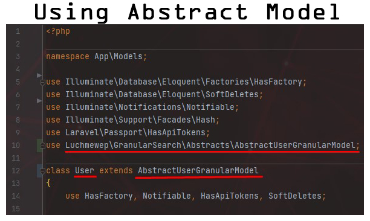
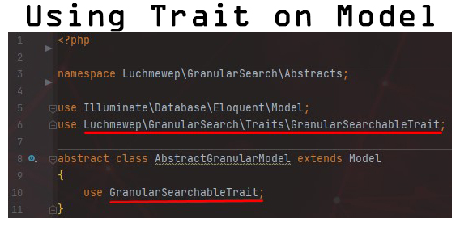
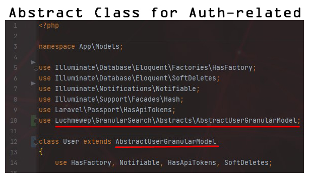
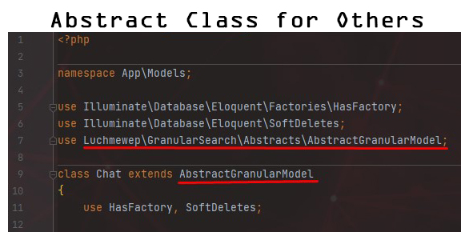
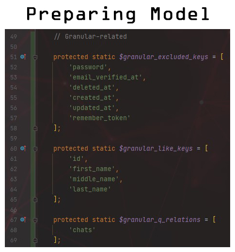
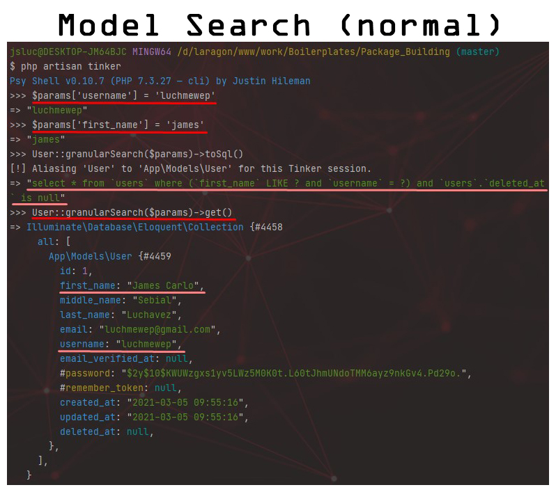
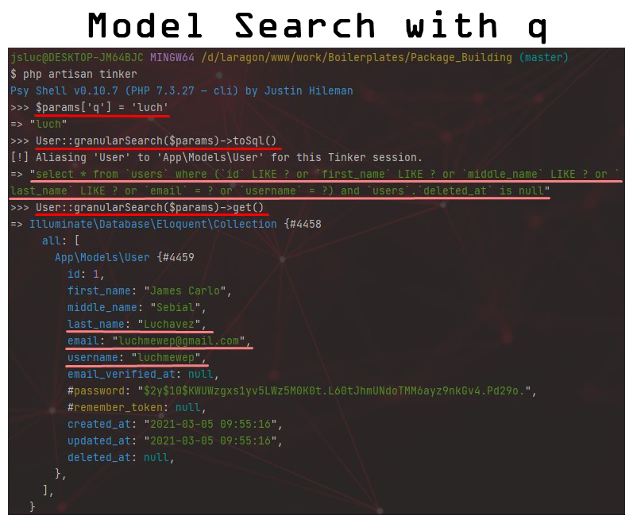
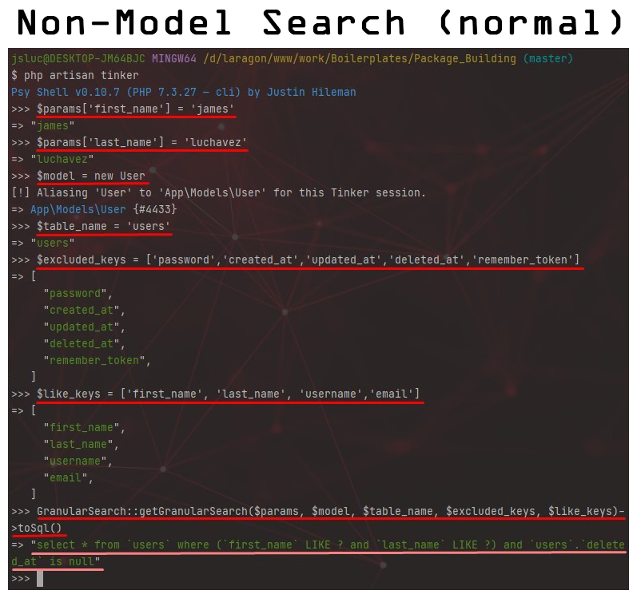
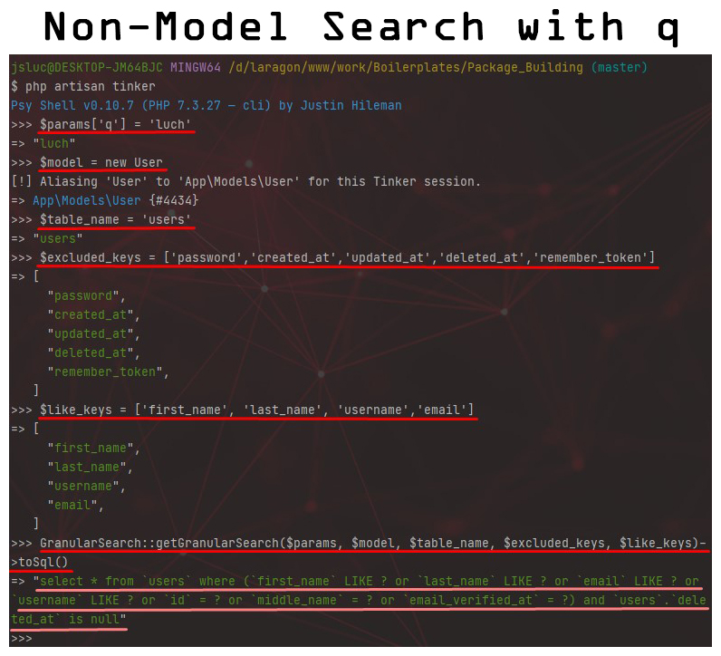

# GranularSearch

[![Latest Version on Packagist][ico-version]][link-packagist]
[![Total Downloads][ico-downloads]][link-downloads]

Granular Search is an Eloquent model utility for implementing searching, filtering, and sorting with fewer lines of code.

## Installation

Via Composer

```bash
$ composer require luchmewep/granular-search
```

## Usage

To use this package, you have two options. You can either implement it on your Eloquent models, or you can just use the main method of this package which is the `getGranularSearch` (see `GranularSearchTrait`).

However, to fully utilize this package, the **_preferred way_** would be to implement the prepared Traits and Abstract Models. If still in doubt, you can just use the non-model intrusive way which is using the `GranularSearch` class itself.

### Implement on Eloquent Models

There are two (2) ways to implement Granular Search on Eloquent models:
1. By extending the `AbstractGranularModel` or `AbstractGranularUserModel` for User-based models. (**Highly Suggested**)



2. By using the `GranularSearchableTrait` on your Eloquent models.



#### Extending the Abstract Models

Currently, there are two (2) models to choose from. For models that are unrelated to authentication, you can just use the `AbstractGranularModel`. As for authentication-related ones, using `AbstractGranularUserModel` is advised.

These two abstract classes are not really hard to understand since they just use the `GranularSearchTrait` and `GranularSearchableTrait`. They are just prepared beforehand to minimize trait-related bugs.





Once extended, you should set up these protected static fields.

```php
// Model fields to be excluded from filtering
protected static $granular_excluded_keys = [];
// Model fields to use LIKE instead instead of equal
protected static $granular_like_keys = [];
// Relations to consider for filtering/searching
protected static $granular_allowed_relations = [];
// Relations to include on 'q' search (must be a subset of allowed relations array)
protected static $granular_q_relations = [];
```



#### Tinker Examples

* **Normal Search / Filter**

1. Filtering using model's own fields



2. Filtering using `q` as parameter



* **Relational Search / Filter**

3. Filtering through `relations` using other model's **prepended** fields
   


4. Filtering through `relations` using `q` parameter


### Implement Manually

If you are not prepared to try it out on your current Eloquent models, you might want to test it out first using the `GranularSearch` class itself. Since the getGranularSearch is a static method, we don't need to instantiate the GranularSearch class. Here are the parameters for the static method:

```injectablephp
/**
 * Filter the model collection using the contents of the $request variable.
 *
 * @param Request|array $request Contains all the information regarding the HTTP request
 * @param Model|Builder $model Model or query builder that will be subjected to searching/filtering
 * @param string $table_name Database table name associated with the $model
 * @param array $excluded_keys Request keys or table column names to be excluded from $request
 * @param array $like_keys Request keys or table column names to be search with LIKE
 * @param string $prepend_key
 * @param bool $ignore_q
 * @return Model|Builder
 */
```

##### Tinker Examples

1. Filtering using model's own fields



2. Filtering using `q` as parameter




## Change log

Please see the [changelog](changelog.md) for more information on what has changed recently.

## Testing

```bash
$ composer test
```

## Contributing

Please see [contributing.md](contributing.md) for details and a todolist.

## Security

If you discover any security related issues, please email author email instead of using the issue tracker.

## Credits

-   [James Carlo Luchavez][link-author]
-   [All Contributors][link-contributors]

## License

license. Please see the [license file](license.md) for more information.

[ico-version]: https://img.shields.io/packagist/v/luchmewep/granular-search.svg?style=flat-square
[ico-downloads]: https://img.shields.io/packagist/dt/luchmewep/granular-search.svg?style=flat-square
[ico-travis]: https://img.shields.io/travis/luchmewep/granular-search/master.svg?style=flat-square
[ico-styleci]: https://styleci.io/repos/12345678/shield
[link-packagist]: https://packagist.org/packages/luchmewep/granular-search
[link-downloads]: https://packagist.org/packages/luchmewep/granular-search
[link-travis]: https://travis-ci.org/luchmewep/granular-search
[link-styleci]: https://styleci.io/repos/12345678
[link-author]: https://github.com/luchmewep
[link-contributors]: ../../contributors
